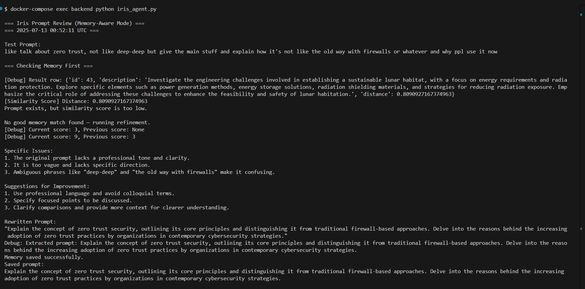
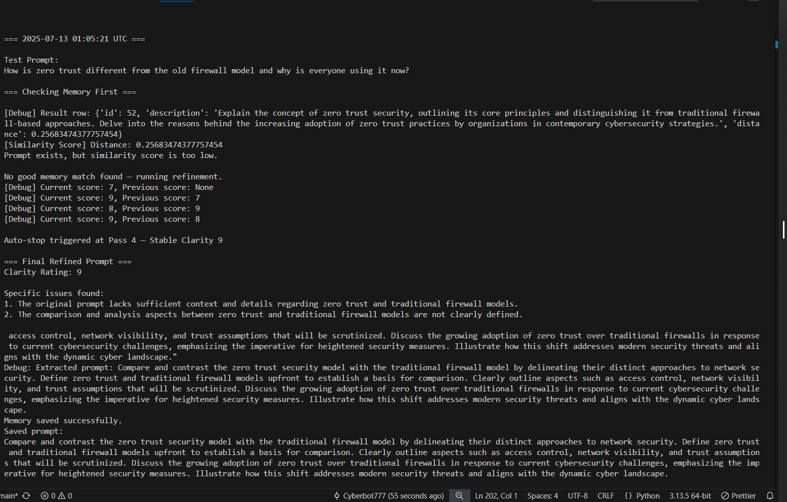
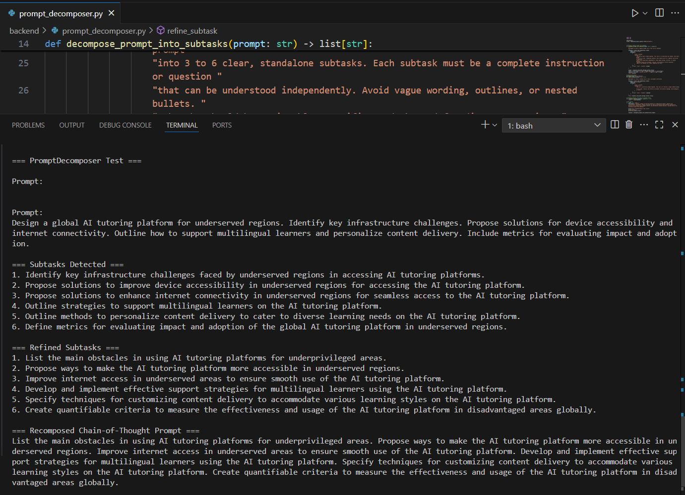
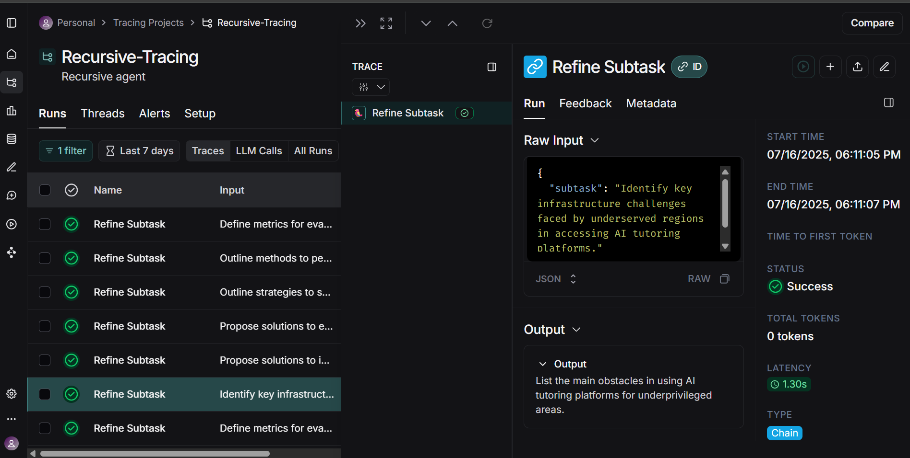

# ♾️ Recursive

**Self-Refining Prompt Optimization System — Featuring Iris, the Recursive Prompt Agent**

---

## Overview

**Recursive** is an AI research agent that automatically optimizes, clarifies, and refines prompts for large language models (LLMs) using structured, recursive prompting loops.

At its core is **Iris** — the recursive prompt optimization agent.

Iris performs self-improvement by:
- Analyzing prompts for clarity, length, and effectiveness.
- Providing structured reviews with clarity ratings and specific suggestions.
- Rewriting prompts to reduce ambiguity and improve precision.
- Logging every review and rewrite cycle for traceability.
- Auto-stopping when clarity improvements stabilize.
- Saving final prompts to a vector database with OpenAI embeddings.
- Comparing new prompts to historical memory using semantic similarity.
- Leveraging **contextual memory injection** to guide new refinements using the top-N most relevant past prompts.
- Improving recursively by **prioritizing past high-scoring examples**, helping Iris evolve more intelligently with each cycle.

This project explores **recursive prompting** — where an LLM teaches itself to write better prompts through feedback, iteration, and memory.

---

## Technologies Used

### Core
- **Python** — Core logic and orchestration.
- **OpenAI API** — Prompt evaluation and embeddings (`text-embedding-3-small`).
- **Docker + Docker Compose** — Containerization and environment management.

### Database
- **PostgreSQL** — Persistent memory storage for prompt histories.
- **pgvector** — Semantic vector search extension for PostgreSQL (now fully integrated and operational).

---

## Features

- Recursive, multi-pass prompt optimization.
- Automatic clarity scoring and rewriting.
- Auto-stop mechanism when clarity stabilizes.
- Memory system stores **only the final rewritten prompt** in the vector DB.
- Semantic similarity comparison to detect previously seen ideas.
- Memory-aware refinement using **contextual recall of top-N nearest prompts**.
- Dynamic prompt rewriting that adapts based on successful past examples.
- Fully Dockerized backend and database system.
- **Memory-Aware Refinement**: Iris recalls top-N similar prompts from past rewrites using vector search (pgvector) and builds contextual memory to guide new prompt improvements.
- **Adaptive Self-Improvement**: As prompts are refined and saved, Iris improves future rewrites using accumulated knowledge — achieving higher clarity scores faster.
- **Empirical Validation Framework**: Built-in debug and logging tools show step-by-step refinement passes, scores, and final output for transparency and testing.
- **Chain-of-Thought Decomposition**: For complex or multi-part prompts, Iris invokes a custom Chain-of-Thought decomposer module that splits the prompt into subtasks, refines each subtask, then recomposes the results into a clean, coherent prompt.
- **Automatic Complexity Detection**: Iris uses a lightweight signal-based heuristic to detect multi-phase or complex prompts (e.g., prompts containing phrases like "compare and contrast," "step-by-step," or multi-part lists) and route them through the Chain-of-Thought flow.

---

## Vector Memory Testing

Iris now includes a fully operational vector memory backend.

### Completed Milestones
- Final prompt storage confirmed in PostgreSQL using `pgvector`
- Similarity scoring with cosine distance verified
- Memory is being embedded using `text-embedding-3-small`
- Embeddings are now normalized (confirmed via manual test script)
- Vector index (`hnsw` with `vector_cosine_ops`) created for fast retrieval

### Example: Inspecting the Vector DB

```bash
docker-compose exec db psql -U iris_user -d iris_memory
```

Then inside the DB shell:

```sql
SELECT id, description FROM memories ORDER BY id DESC;
```

To inspect vector column metadata:

```sql
\d+ memories
SELECT * FROM pg_indexes WHERE tablename = 'memories';
```

---

## Semantic Recall Proof of Concept

In July 2025, Iris was successfully tested with automatic semantic memory recall:

1. A messy informal prompt about zero trust security was refined through multi-pass review and stored in memory.
2. A later prompt about firewall-based security was semantically similar (distance ≈ 0.256).
3. Because the system threshold was set to 0.2, Iris chose not to reuse the match — but correctly located it, demonstrating accurate recall behavior.

Memory is embedded via OpenAI’s `text-embedding-3-small`, stored in PostgreSQL as `vector(1536)`, queried using cosine distance via `<=>`, and filtered by a tunable similarity threshold.

### Screenshots




---

## Chain-of-Thought Decomposition Validation

In July 2025, we added a **Chain-of-Thought Prompt Decomposer** to support complex or multi-focus prompts.

When Iris detects signal phrases indicating a multi-part task, she routes the prompt through this new module:
1. The decomposer breaks it into subtasks.
2. Each subtask is refined individually.
3. The subtasks are recombined into a single clean CoT-style prompt.
4. The result is then returned to Iris for final recursive refinement and scoring.

We verified the decomposition and refinement chain using **LangSmith**, confirming that each step is invoked and traced correctly.

### Screenshots





---

## Docker Usage

Recursive runs inside Docker for consistent dev and testing environments.

### Environment Setup (One-Time Step)

Before running anything, copy the example environment file and add your OpenAI API key:

```bash
cp backend/.env.example backend/.env
```

Then open the new `.env` file and replace the placeholder with your actual key:

```env
OPENAI_API_KEY=sk-...
```

### Start Backend + Vector DB:

```bash
docker-compose up --build -d
```

### Run Iris Agent:

```bash
docker-compose exec backend python iris_agent.py
```

### Run Chain-of-Thought Decomposer:

```bash
docker-compose exec backend python prompt_decomposer.py
```

### Optional: Vector Norm Check

You can run a norm test script to ensure embeddings are unit vectors:

```bash
docker-compose exec backend python test_vector_norm.py
```

---

## Roadmap

### **Phase 1:** Prompt Refinement Core
- [x] Clarity scoring
- [x] Auto-rewriting
- [x] Recursive cycles
- [x] Auto-stop logic

### **Phase 2:** Embedding + Memory Storage
- [x] Integrate OpenAI embedding API
- [x] PostgreSQL + pgvector storage
- [x] Manual insert/query test

### **Phase 3:** Memory-Assisted Refinement
- [x] Save only final rewritten prompt to DB
- [x] Enable semantic recall via vector similarity
- [x] Use memory during refinement to avoid repeating known ideas
- [x] Improve memory recall quality (threshold tuning, N-best ranking, logging)
- [x] Prioritize high-scoring historical prompts when forming memory context

### **Phase 4:** Chain-of-Thought Preprocessing
- [x] Add prompt decomposer module
- [x] Break prompt into subtasks
- [x] Refine subtasks individually
- [x] Reassemble final CoT prompt
- [x] Return to Iris for multi-pass review
- [x] Validate full chain in LangSmith

### **Phase 5:** Agent Routing Automation (Planned)
- [ ] Modular router between Iris and Decomposer
- [ ] LangGraph or dispatcher-based flow manager
- [ ] Route intelligently based on complexity heuristics

---

## Author

Created and maintained by [Cyberbot777](https://github.com/Cyberbot777).

